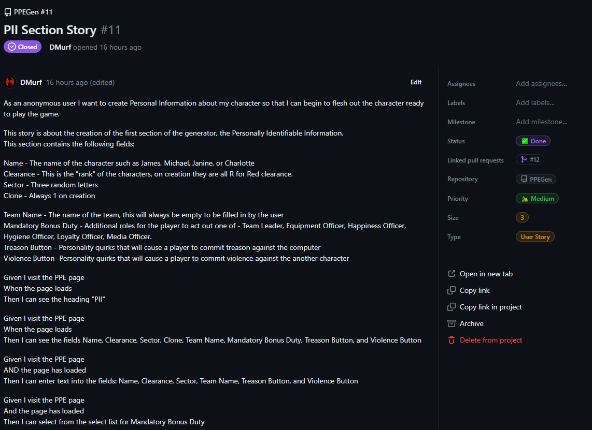
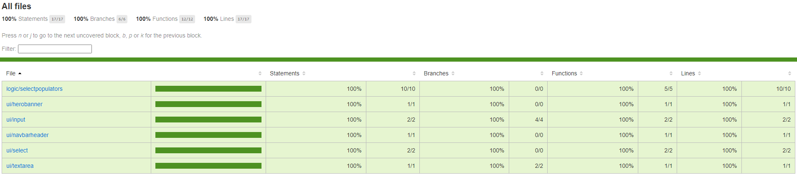

# Paranoia Perfect Edition Roleplaying Game - Character Generator

Built for Northeastern University.

All ownership of Paranoia, Paranoia Perfect Edition, or other related assets are owned by Mongoose Publishing. 

| | Badge | ENV |
| --- | --- | --- |
| Code Cov | [](https://codecov.io/gh/DMurf/PPEGen) |
| SNYK |  |
| TEST ENV | [](https://app.netlify.com/sites/ppegen-test/deploys) | https://ppegen-test.netlify.app/
| LIVE ENC | [](https://app.netlify.com/sites/ppegen/deploys) | https://ppegen.netlify.app/


## Proposition

Every company needs some bonding and team building even [Forbes says so](https://www.forbes.com/sites/brianscudamore/2016/03/09/why-team-building-is-the-most-important-investment-youll-make/). 

A nice bit of escapism for a team is pretending to be somewhere else and attempted to work together to beat the common challenge, to support this, of sorts, this tool was created. 


### Existing game


"Paranoia" is a tabletop role-playing game (RPG) known for its satirical and darkly comedic take on a dystopian future. Over the years, there have been several editions of the game, each with its own unique features and updates. Here's a brief summary of each version:

#### First Edition (1984):

The original version, set in an underground city ruled by an insane and paranoid computer. Players are Troubleshooters tasked with maintaining the system and dealing with traitors and threats.

#### Second Edition (1987):

Expanded and refined rules from the first edition, providing a more streamlined gameplay experience. Introduced elements like secret societies and complex mission structures.

#### XP Edition (2004):

A reboot of the original game, introducing a simplified rule system and emphasizing a more fast-paced and humorous gameplay. It maintained the setting of Alpha Complex under the control of The Computer.

#### Paranoia XP: Imploding Now (2005):

An updated version of the XP Edition with additional content and rules for character creation and gameplay. Emphasized the humour and dark satire inherent in the game.

#### Paranoia: Troubleshooters (2017):

This edition returned to the original game's feel, focusing on a more lethal and challenging gameplay. Provided a gritty and darker tone compared to the XP Edition.

#### Paranoia Red Clearance Edition (2017):

Another contemporary reboot with streamlined rules and mechanics. It introduced "clearance levels" for characters, incorporating an element of social hierarchy within Alpha Complex.

#### Paranoia Perfect Edition (2023)

The newest, shiniest, most perfect version of the game.

Each edition maintains the core theme of a dystopian future controlled by an insane computer, where players navigate a world of secrecy, backstabbing, and dark humour, often in pursuit of conflicting goals while trying to survive the deadly missions and the wrath of The Computer.


## Foundation

The application will be based off the existing character sheet available on the Mongoose Publishing website [Downloads](https://www.mongoosepublishing.com/pages/downloads-htm) and also a backup [locally](/assets/ParanoiaCharSheet.pdf)


## Design

The following prototype was created using [Excalidraw](https://excalidraw.com/) which is a brilliant and easy sketching/design tool, available for free, and also open-source for self-hosting.

### Prototype

On desktop view (the main focus)

[Desktop plan](/assets/plan-desktop.png)

On mobile view 

[Mobile plan](/assets/plan-mobile.png)

The plan for the layout will be using responsive design, with the main design being desktop-first but all elements able to resize down to a mobile-friendly view.

### Styling

The intention is to make a design that fits with the aesthetic of the character sheet whilst also ensuring compliance with best practices and standards. 

#### Theme

The CSS theme used is a custom version of [Lux](https://jenil.github.io/bulmaswatch/lux/) which itself in an implementation of [Bulma](https://bulma.io/) css framwork. Lux uses scss overrides to style Bulma, and on top of this I have tweaked the theme to fit the required aesthetic. The output of this is in the following folder:

` <root>/styles/lux` 

The key files are 

`<root>/styles/lux/_overrides.scss`

`<root>/styles/lux/_variables_.scss`

These are them compiled into 

`<root>/styles/lux/bulmaswatch.css`

More information on this process is available at the [Bulma website](https://bulma.io/documentation/customize/with-node-sass/)

Additionally some tweaks or additional styling is available in 

`<root>/src/App.css`

#### Fonts

The following fonts are used from Google Fonts, under the SIL OPEN FONT LICENSE Version 1.1:
* Inter by Rasmus Andersson
* Bebas Neue by Ryoichi Tsunekawa
* Courier Prime by Alan Dague-Greene


## Planning

The planning board is located [here](https://github.com/users/DMurf/projects/3) and is setup using the GitHub project template "Team Backlog". This is setup as a KanBan board.


### Agile methodology


This project uses a cut-down version of KanBan [here](https://www.developmentthatpays.com/files/DevelopmentThatPays-ScrumVsKanban-CheatSheet-1_6.pdf) and [here](https://learn.microsoft.com/en-us/devops/plan/what-is-kanban) however as there's only one member of the team, many of the ceremonies hold little-to-no value. 


### Features

Features are the definition of a deliverable in this application, something that is marketable or demonstrable to a user such as "This button saves the picture to your computer" or "Styling UI to fit corporate theme". The principle behind features is the [Minimum Marketable Feature](https://www.techtarget.com/whatis/definition/minimum-marketable-feature-MMF), where each feature is delivered because of value to either the business or users.

### User stories

User stories are tickets below Features, and following the Extreme Programming design follow the pattern

* As a <role> I want to <verb-centric behaviour> so that <user value added>

This pattern is originally from Extreme Programming (XP) [more information available here](https://martinfowler.com/bliki/UserStory.html)

Each user story will be assigned an estimated ticket size, this is based on fibonacci (1, 2, 3, 5, 8, 13...) and this signifies the relative complexity of each ticket. 

A user story is intended to be the placeholder of a conversation, and should not be overly proscribed. In this project, the user story should contain most of the details to implement the requirement.

### Definition of ready

A feature is ready once it has enough description to convey the goal of the ticket. 

A user story is ready once it has a complete story, a defined or linked user persona, and a list of acceptance criteria. It's beneficial to have diagrams, pictures, or extra information to help flesh out the story. 

### Definition of done

A feature is done once all it's user stories have been fulfilled and tested.
Additionally a feature would be approved by the product owner as meeting all required functionality. 

A user story is done when all it's acceptance criteria have been tested and pass reliably. 
Additionally a User Story would ideally be peer-reviewed by another developer.

### Acceptance criteria

Acceptance criteria are often in the form of "Given, When, Then" or [Gherkin](https://www.guru99.com/gherkin-test-cucumber.html) format such as 

* Given I navigate to the home page
* When I click on the randomise button
* Then all free-text fields should have text entered

### Ticket example


### MVP

The Minimum Viable Product for the PPEGen would follow the following:

* A public user can fill in all the fields themselves.
* A public user can click randomise all and all fields would be filled in for them. 
* A public user can choose to print the character sheet in a printer-friendly way.
* A public user can randomise sections of the character sheet and over-write any options they choose to.

#### Extended goals

* A public user can save their character to local storage
* A public user can download their character configuration to pass to other players

## Building

### Technology stack

This app uses the following technologies

* [HTML](https://devdocs.io/html/)
* [CSS](https://devdocs.io/css/)
    * [Sass](https://devdocs.io/sass/)
* [Javascript](https://devdocs.io/javascript/) / [Typescript](https://www.typescriptlang.org/)
* [React](https://react.dev/)
* [React Testing Library](https://testing-library.com/docs/react-testing-library/intro/)
* [Jest](https://jestjs.io/)
* [GitHub](https://github.com/)
* [Netlify](https://www.netlify.com/)
* [Codecov](https://about.codecov.io/)
* [SNYK](https://snyk.io/)
* [Vite](https://vitejs.dev/)

### DevOps / CI-CD pipelines

This project utilises Continuous Delivery 


Image from [here](https://medium.com/@ahshahkhan/devops-culture-and-cicd-3761cfc62450)

#### Continuous Integration

Continuous Integration (CI) involves building and unit-testing the code changes immediately after the
developer checks it in, thus enabling the newly incorporated changes to be continually tested. The
main idea behind this practice is to test the code frequently as the development process proceeds, so
that possible issues are identified and rectified early.

#### Continuous Delivery 

Continuous delivery is an extension of CI. In this process, developed code is continuously delivered as
soon as the developer deems it ready for being shipped. It involves continuous integration, testing
automation and deployment automation processes, which enable rapid and reliable development
and delivery of software with the least manual overhead. The core idea is to deliver the code to QA,
customers, or any user base so that it can be constantly and regularly reviewed

#### Continuous Deployment

Continuous Deployment is the next logical step after continuous delivery. It is the process of
deploying the code directly to the production stage as soon as it is developed. In CD, all the changes
that pass the automated tests are automatically deployed to the production stage.

Dave Farley of [Continuous-Delivery.co.uk](https://www.continuous-delivery.co.uk/) wrote the book on CD, more information is available there.

#### Branch policy

The main branch is protected to disallow direct pushes without a Pull Request.

#### Environments

There are two environments, Test and Live.

Test is automatically updated whenever the Pull-Request process is updated. Live has a manual trigger that allows for fine-grained control over the deployment schedule.

#### Scripts 
Yaml

#### Architecture

The application is a Single-Page Application (SPA) rendered using [React.js](https://react.dev/). The core of the application is inside the /src/ folder. In there are the /components/ which comprises of any /logic/ - processes or translation of data/text/content and /ui/ where each bulma component is wrapped into an object. All these have .test. files adjacent. These files are all then referenced in /src/App.tsx which itself is called via /src/main.tsx.

## Testing

### Functional

Libraries used:

* jest
* jest-dom
* react-testing-library
* user-event 

#### Unit testing

Unit testing is a crucial practice in software development that involves testing individual units or components of code to ensure their correctness and functionality in isolation. These units typically correspond to specific functions, methods, or classes within a software application. This process allows for the code or components to be built in isolation, and also tested in isolation. This increases the speed of building and lowers complexity of change. The Unit tests are also designed to provide rapid feedback to their user to enable fast-fixing of problems and increase confidence of any changes made to the application.

For this project, Jest is the main unit testing library and running the command

`npm test`

Will run all the tests that Jest is aware of and output reports as configured. In the terminal they look similar to:


File                    | % Stmts | % Branch | % Funcs | % Lines | Uncovered Line #s 
------------------------|---------|----------|---------|---------|-------------------
All files               |     100 |      100 |     100 |     100 |                   
 logic/selectpopulators |     100 |      100 |     100 |     100 |                   
  flags.tsx             |     100 |      100 |     100 |     100 |                   
  mbd.tsx               |     100 |      100 |     100 |     100 |                   
  mutantpowers.tsx      |     100 |      100 |     100 |     100 |                   
  secretsocieties.tsx   |     100 |      100 |     100 |     100 |                   
  wounds.tsx            |     100 |      100 |     100 |     100 | 
 ui/herobanner          |     100 |      100 |     100 |     100 | 
  hero.tsx              |     100 |      100 |     100 |     100 | 
 ui/input               |     100 |      100 |     100 |     100 | 
  input.tsx             |     100 |      100 |     100 |     100 | 
  inputNumber.tsx       |     100 |      100 |     100 |     100 | 
 ui/navbarheader        |     100 |      100 |     100 |     100 | 
  navbar.tsx            |     100 |      100 |     100 |     100 | 
 ui/select              |     100 |      100 |     100 |     100 | 
  select.tsx            |     100 |      100 |     100 |     100 | 
 ui/textarea            |     100 |      100 |     100 |     100 | 
  textarea.tsx          |     100 |      100 |     100 |     100 | 


* Test Suites: 11 passed, 11 total
* Tests:       34 passed, 34 total
* Snapshots:   0 total
* Time:        4.836 s

Also using the code coverage output results in the following website being made available



This is available at 

`<root>/coverage/lcov-report/index.html`

and is refreshed whenever the test command is run.

#### UI/Automated testing

#### Manual testing

### Non-functional

#### Volume/Stress testing/Load testing

#### Accessibility

### Standards

#### WCAG compliance

### Security

#### OWASP

#### Pen Test

### Monitoring


## Documentation

### Mid-flight design changes

Productivity Profile changed to better fit the available space and size requirements of the fields. Also true of Secret side, and Wellness

### Recreation

### How-to guide


# Boilerplate

This is a React.js project, bootstrapped with vite - v4.4.1 configured with TypeScript


## Getting Started


First, run the development server:

```terminal 
npm run dev
```

Open [http://localhost:<port>](http://localhost:<port>) with your browser to see the result.

You can start editing the page by modifying `app/page.js`. The page auto-updates as you edit the file.

This project uses [`next/font`](https://nextjs.org/docs/basic-features/font-optimization) to automatically optimize and load Inter, a custom Google Font.

## Learn More

To learn more about Next.js, take a look at the following resources:

- [Next.js Documentation](https://nextjs.org/docs) - learn about Next.js features and API.
- [Learn Next.js](https://nextjs.org/learn) - an interactive Next.js tutorial.

You can check out [the Next.js GitHub repository](https://github.com/vercel/next.js/) - your feedback and contributions are welcome!

## Deploy on Vercel

The easiest way to deploy your Next.js app is to use the [Vercel Platform](https://vercel.com/new?utm_medium=default-template&filter=next.js&utm_source=create-next-app&utm_campaign=create-next-app-readme) from the creators of Next.js.

Check out our [Next.js deployment documentation](https://nextjs.org/docs/deployment) for more details.

## License

MIT
